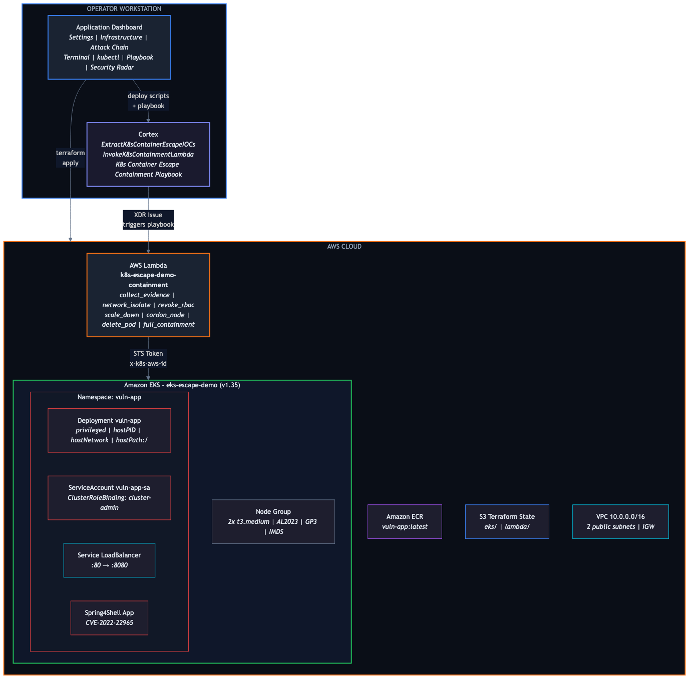
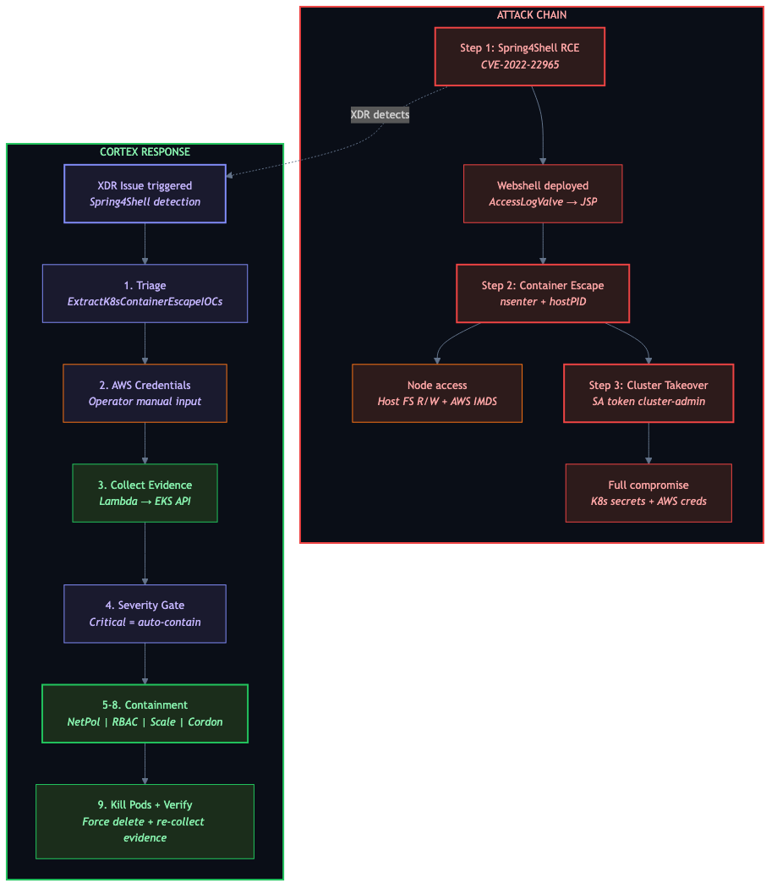

# Kubernetes Container Escape Demo

Full attack chain demo on AWS EKS — from Spring4Shell RCE to container escape to cluster takeover — with automated detection by Cortex XDR and incident response via Cortex playbook + AWS Lambda containment.

Everything is orchestrated from a **web dashboard**: infrastructure provisioning, attack execution, and automated remediation.

## Architecture Diagram



## Attack & Response Chain



## Quick Start

### Prerequisites

| Tool | Version | Purpose |
|------|---------|---------|
| **AWS CLI** | v2+ | AWS API access |
| **Terraform** | >= 1.5 | Infrastructure provisioning |
| **kubectl** | latest | Kubernetes management |
| **Docker** | with buildx | Image build (cross-compilation ARM → AMD64) |
| **Python** | 3.9+ | Dashboard application |
| **AWS Account** | admin access | Initial bootstrap (one-time) |
| **Cortex Instance** | XSIAM/XSOAR | Playbook deployment (optional) |

### 1. Clone & Launch Dashboard

```bash
git clone https://github.com/cortex-cloud-demo/K8s-Container-Escape-Demo.git
cd K8s-Container-Escape-Demo/dashboard
./run.sh
```

This creates a Python virtual environment, installs dependencies, and starts the dashboard.

Open **http://localhost:5555**

### 2. Configure AWS Credentials

In the dashboard, click **AWS > Configure** and enter your admin credentials:
- **Access Key ID**
- **Secret Access Key**
- **Session Token** (if using SSO/temporary credentials)
- **Region** (e.g. `eu-west-2`)

Click **Test** to verify connectivity.

> Credentials are stored in-memory only and never persisted to disk.

### 3. Deploy Infrastructure (~15 min)

Click **INFRA > Apply** — Terraform provisions:
- VPC (2 public subnets, Internet Gateway, route tables)
- EKS cluster (AL2023 nodes, GP3 volumes)
- ECR repository
- Dashboard IAM User + Operator Role
- EKS access entries

### 4. Switch to Dashboard User (permanent credentials)

After infra is deployed, retrieve the dedicated dashboard user credentials:

```bash
cd terraform-infra
terraform output dashboard_user_access_key_id
terraform output -raw dashboard_user_secret_access_key
```

Paste these in **AWS > Configure** (Access Key + Secret Key, no Session Token needed). These credentials never expire.

### 5. Build, Deploy & Attack

| Step | Card/Button | Action |
|------|-------------|--------|
| Connect | **Connect** | Generates kubeconfig |
| Build | **Build Image** | Docker build (linux/amd64) + push to ECR |
| Deploy | **Deploy** | K8s manifests: namespace, SA, privileged deployment, LB |
| RCE | **Step 1: Exploit** | Spring4Shell webshell |
| Escape | **Step 2: Escape** | Container escape via nsenter, mount, chroot, IMDS |
| Takeover | **Step 3: Takeover** | cluster-admin SA token, secrets, AWS creds |
| Scanning | **Step 4: Scan** | K8s vulnerability scanning (T1610/T1613) |
| Malware | **Step 5: Deploy** | WildFire ELF, reverse shell, cryptominer, deepce |
| Lateral | **Step 6: Move** | SSH scan, rogue pod, IMDS theft, cross-namespace |

### 6. Deploy Cortex Response

| Step | Card | Action |
|------|------|--------|
| Lambda | **LAMBDA > Apply** | Terraform: Lambda function, IAM, EKS access entry, Cortex IAM user |
| Scripts | **CORTEX > Deploy** (per script) | Push individual automation scripts to Cortex (triage, containment, forensic, threat hunt) |
| Playbooks | **CORTEX > Deploy** (per playbook) | Push individual playbooks to Cortex (containment, forensic, search similar events) |
| All | **CORTEX > Deploy All** | Push all 4 scripts + 3 playbooks at once |
| Policy | **POLICY > Import** | Import prevention policy rules + profiles (BETA) |

### 7. Cleanup

Click **Destroy Lambda** then **Destroy All** in the Cleanup section. The dashboard automatically cleans up K8s resources (LoadBalancer, ENIs, EIPs) before running `terraform destroy`.

## Components

| Component | Description |
|-----------|-------------|
| **Dashboard** | Web UI to orchestrate the full demo (infra, attack, response, security radar) |
| **EKS Cluster** | AWS managed Kubernetes on AL2023 with GP3 volumes |
| **ECR** | Container registry for the vulnerable image |
| **Vulnerable App** | Spring Boot app with CVE-2022-22965 (Spring4Shell) on Tomcat 9 |
| **Pod Misconfigs** | `privileged`, `hostPID`, `hostNetwork`, `hostPath: /`, SA `cluster-admin` |
| **Lambda** | Containment function authenticating to EKS via STS (x-k8s-aws-id) |
| **Cortex Scripts** | `ExtractK8sContainerEscapeIOCs` (triage) + `InvokeK8sContainmentLambda` (containment) + `K8sForensicAnalysis` (CVE/MITRE/XQL) + `K8sSearchSimilarEvents` (threat hunt) |
| **Cortex Playbooks** | 3 playbooks: Containment (10 tasks), Forensic Analysis (9 tasks, 5 XQL auto-exec), Search Similar Events (8 tasks, 3 XQL auto-exec) |
| **Prevention Policy** | Prevention rules, profiles & endpoint group for K8s nodes (BETA) |

## IAM Architecture

The project uses **dedicated IAM Users with permanent Access Keys** and **scoped IAM Roles** (least-privilege). No admin credentials are needed after the initial bootstrap.

### Authentication Flow

```
┌─────────────────────────────────────────────────────────────────────┐
│  BOOTSTRAP (one-time, admin credentials)                            │
│                                                                     │
│  Admin credentials ──► terraform apply (terraform-infra/ + terraform-lambda/)
│                          ├── VPC, EKS, ECR, Lambda                  │
│                          ├── Dashboard IAM User + Operator Role     │
│                          └── Cortex IAM User + Lambda Invoker Role  │
└─────────────────────────────────────────────────────────────────────┘

┌─────────────────────────────────────────────────────────────────────┐
│  DASHBOARD (permanent credentials, no expiration)                   │
│                                                                     │
│  dashboard-user (Access Key) ──► AssumeRole ──► dashboard-operator  │
│                                                   ├── EKS, ECR      │
│                                                   ├── Lambda, IAM   │
│                                                   └── VPC, Logs     │
└─────────────────────────────────────────────────────────────────────┘

┌─────────────────────────────────────────────────────────────────────┐
│  CORTEX PLAYBOOK (permanent credentials, no expiration)             │
│                                                                     │
│  cortex-playbook-user (Access Key) ──► AssumeRole ──► lambda-invoker│
│                                                        └── lambda:  │
│                                                         InvokeFunction│
└─────────────────────────────────────────────────────────────────────┘
```

### IAM Users & Roles

| Resource | Module | Purpose |
|----------|--------|---------|
| `k8s-escape-demo-dashboard-user` | `terraform-infra/` | Permanent Access Key → AssumeRole on operator role |
| `k8s-escape-demo-dashboard-operator` | `terraform-infra/` | Scoped permissions (EKS, ECR, Lambda, IAM, VPC, Logs, ELB) |
| `k8s-escape-demo-cortex-playbook-user` | `terraform-lambda/` | Permanent Access Key → AssumeRole on invoker role |
| `k8s-escape-demo-lambda-invoker` | `terraform-lambda/` | `lambda:InvokeFunction` on containment Lambda only |

### Getting Credentials

```bash
# Dashboard user
cd terraform-infra
terraform output dashboard_user_access_key_id
terraform output -raw dashboard_user_secret_access_key

# Cortex playbook user
cd terraform-lambda
terraform output cortex_user_access_key_id
terraform output -raw cortex_user_secret_access_key
terraform output lambda_invoker_role_arn
```

## Dashboard Tabs

| Tab | Purpose |
|-----|---------|
| **Overview** | Architecture overview, 6-step attack chain, MITRE techniques, auth flow |
| **Terminal** | Main output for all operations + webshell command execution |
| **kubectl** | Interactive kubectl with shortcut buttons (nodes, pods, secrets, kill pods) |
| **Cortex** | Cortex playbook flow visualization + deployment output (scripts, playbooks) |
| **SOC Live** | Real-time Cortex XDR alerts, MITRE ATT&CK heatmap, attack/detect/contain timer |
| **Code** | Shift-left view: CVE details, K8s misconfigurations, IaC findings with fixes |
| **Security Radar** | Before/after security posture comparison (6-axis spider chart) |

### Security Radar

Visual security posture assessment — 6 axes scored 0-100:

| Axis | Vulnerable (10) | Secure (95) |
|------|-----------------|-------------|
| Network Isolation | No NetworkPolicy | deny-all applied |
| RBAC Security | cluster-admin bound | ClusterRoleBinding deleted |
| Pod Security | Privileged pods | No pods running |
| Node Security | Nodes schedulable | Node(s) cordoned |
| Deployment Control | Replicas > 0 | Scaled to 0 |
| Evidence | No forensic data | Events + logs collected |

**Usage:** Snapshot Before (red) → Run containment → Scan Current (green overlay)

## Cortex Integration

### Automation Scripts

#### `ExtractK8sContainerEscapeIOCs` — Triage & IOC Extraction

Analyzes XDR issue fields to extract Indicators of Compromise: container ID, namespace, node FQDN, process name/SHA256, container image ID. Determines incident severity (Critical/High/Medium/Low) based on attack indicators — Spring4Shell exploitation, webshell deployment, container escape techniques, and credential theft. Detects Spring4Shell patterns (ClassLoader manipulation, `class.module` parameters) and webshell indicators (`.jsp` file drops, `Runtime.getRuntime`, `ProcessBuilder`). Populates `K8sEscape.*` context keys used by all downstream scripts and playbooks. Writes a formatted triage report to the `k8scontainerescapeiocs` issue field.

**Outputs:** `K8sEscape.ContainerID`, `K8sEscape.Namespace`, `K8sEscape.ClusterName`, `K8sEscape.NodeFQDN`, `K8sEscape.ProcessName`, `K8sEscape.ProcessImageSHA256`, `K8sEscape.ContainerImageID`, `K8sEscape.Severity`, `K8sEscape.Details`

#### `InvokeK8sContainmentLambda` — Lambda Containment (SigV4)

Invokes the AWS Lambda containment function from Cortex XSIAM (GCP-hosted — no boto3/AWS SDK available). Uses pure SigV4 signing (`hmac`/`hashlib`) for all AWS API calls: first STS AssumeRole to obtain temporary credentials scoped to the `lambda-invoker` IAM role, then Lambda Invoke with the containment action payload. Supports 7 containment actions: `collect_evidence`, `network_isolate`, `revoke_rbac`, `scale_down`, `cordon_node`, `delete_pod`, `full_containment`. Dual-mode: if `assume_role_arn` is omitted, STS AssumeRole is skipped and Lambda is invoked directly with the operator credentials.

**Outputs:** `K8sContainment.Action`, `K8sContainment.Status`, `K8sContainment.LambdaResponse`, `k8scontainmentenrichment` issue field

#### `K8sForensicAnalysis` — CVE Enrichment, MITRE Mapping & XQL

Performs deep forensic analysis on a container escape incident. CVE enrichment covers Spring4Shell (CVE-2022-22965, CVSS 9.8) and Spring Cloud Function SpEL Injection (CVE-2022-22963, CVSS 9.8) with severity, description, and affected versions. MITRE ATT&CK kill chain mapping covers 9 techniques: T1190 (Exploit Public-Facing Application), T1059.004 (Unix Shell), T1505.003 (Web Shell), T1611 (Escape to Host), T1610 (Deploy Container), T1552.007 (Container API), T1613 (Container and Resource Discovery), T1550.001 (Application Access Token), T1530 (Data from Cloud Storage). Detects container escape indicators (nsenter, mount, chroot, `/proc/1/root`, IMDS, `docker.sock`, `/var/run/secrets`, etc.). Generates 5 XQL forensic queries stored in `K8sForensic.XQLQueries` array for automatic execution by the Forensic Analysis playbook.

**Outputs:** `K8sForensic.DetectedCVEs`, `K8sForensic.AttackPhases`, `K8sForensic.EscapeIndicators`, `K8sForensic.XQLQueries[]`, `k8sforensicanalysis` issue field

#### `K8sSearchSimilarEvents` — Cross-Tenant Threat Hunting

Generates XQL threat hunting queries to determine blast radius and detect lateral movement across the Cortex XDR tenant. Produces two categories of queries:

- **Targeted searches** (require specific IOCs from `K8sEscape` context): same process executing on other nodes (lateral movement detection), same binary SHA256 across all endpoints (shared tooling/supply chain), same container image on other K8s nodes (blast radius), other XDR alerts in the same namespace (correlation).
- **Broad threat hunts** (always generated): webshell file drops (`.jsp`, `.php`) across all K8s nodes, container escape patterns (`nsenter`, `chroot`, `/proc/1/root`, suspicious mounts) on all endpoints, IMDS credential theft (`169.254.169.254`) from containers.

Targeted queries are written to the `k8ssearchsimilarevents` issue field for manual execution in Query Center. Broad hunts are executed automatically by the Search Similar Events playbook via `xdr-xql-generic-query`.

**Outputs:** `K8sSimilar.QueriesGenerated`, `K8sSimilar.SearchCriteria`, `K8sSimilar.Queries[]`, `k8ssearchsimilarevents` issue field

### Playbook Authentication Flow

Cortex XSIAM runs on GCP — no AWS SDK available. The script uses **pure SigV4 signing** (`hmac`/`hashlib`):

```
cortex-playbook-user (permanent Access Key)
    │
    ├── 1. STS AssumeRole (SigV4-signed POST)
    │      → sts.<region>.amazonaws.com
    │      → Returns temporary credentials
    │
    ├── 2. Lambda Invoke (SigV4-signed POST)
    │      → lambda.<region>.amazonaws.com
    │      → Containment action payload
    │
    └── 3. Lambda → EKS API
           → STS presigned URL (x-k8s-aws-id)
           → K8s API calls (NetworkPolicy, RBAC, scale, cordon...)
```

**Dual-mode:** if `assume_role_arn` is omitted, STS AssumeRole is skipped and Lambda is invoked directly.

### Playbooks

**3 playbooks** are available, deployable from the dashboard:

#### Containment Playbook (10 tasks)

Automated incident response for K8s container escape. Triages the XDR issue to extract IOCs, collects forensic evidence via Lambda (pod details, logs, events, RBAC audit, node status), then gates on severity: Critical/High with Spring4Shell indicators proceeds automatically to containment, otherwise requests operator approval. Executes full containment sequence via Lambda: deny-all NetworkPolicy, cluster-admin ClusterRoleBinding deletion, deployment scale-down to 0, node cordoning, force pod deletion. Final verification step re-collects evidence to confirm all containment actions succeeded.

```
Start → #1 Triage (ExtractK8sContainerEscapeIOCs)
      → #2 Collect Evidence (Lambda)
      → #3 Severity Check (Critical + SpringShell?)
      → #31 Operator Approval
      → #4 Network Isolation (Lambda: deny-all NetworkPolicy)
      → #5 Revoke RBAC (Lambda: delete cluster-admin ClusterRoleBinding)
      → #6 Scale Down (Lambda: replicas → 0)
      → #7 Cordon Node (Lambda: mark unschedulable)
      → #8 Kill Pods (Lambda: force delete all pods)
      → #9 Verify Containment (Lambda: re-collect evidence)
      → #10 Complete
```

#### Forensic Analysis Playbook (9 tasks)

Deep investigation of a container escape incident. Triages the issue, then runs K8sForensicAnalysis for CVE enrichment (Spring4Shell CVSS 9.8), MITRE ATT&CK kill chain mapping (T1190 → T1611 → T1530), and XQL query generation. Automatically executes 5 XQL queries via `xdr-xql-generic-query` to collect forensic evidence directly from the XDR data lake: process causality chain reconstruction, suspicious file operations (webshell drops, config reads), network connections (IMDS access, C2 channels, K8s API calls), container escape patterns (nsenter, chroot, mount, docker.sock), and credential access attempts (SA tokens, AWS IMDS, kubeconfig). Concludes with live evidence collection via Lambda. All XQL results are available in the playbook context for analyst review.

```
Start → #1 Triage (ExtractK8sContainerEscapeIOCs)
      → #2 Forensic Analysis (K8sForensicAnalysis)
           CVE enrichment, MITRE ATT&CK mapping, XQL query generation
      → #3 XQL: Causality Chain (xdr-xql-generic-query)
      → #4 XQL: File Operations (xdr-xql-generic-query)
      → #5 XQL: Network Connections (xdr-xql-generic-query)
      → #6 XQL: Container Escape Patterns (xdr-xql-generic-query)
      → #7 XQL: Credential Access (xdr-xql-generic-query)
      → #8 Collect Live Evidence (Lambda)
      → #9 Complete
```

#### Search Similar Events Playbook (8 tasks)

Threat hunting playbook to determine if the attack has spread beyond the initially compromised node/container. Generates targeted and broad XQL search queries via K8sSearchSimilarEvents. Automatically executes 3 broad threat hunts via `xdr-xql-generic-query` for immediate visibility: webshell file drops (`.jsp`, `.php`) across all monitored K8s nodes, container escape patterns (`nsenter`, `/proc/1/root`, `chroot`, suspicious mounts) on all endpoints, and IMDS credential theft (`169.254.169.254`) from containers. Targeted IOC queries (same process on other nodes for lateral movement detection, same binary SHA256 across endpoints, same container image for blast radius assessment, namespace alert correlation) are stored in the issue field for manual execution in Query Center. Analyst reviews all automated and manual results, then decides: escalate if similar events found on other nodes, or close if no spread detected.

```
Start → #1 Triage (ExtractK8sContainerEscapeIOCs)
      → #2 Generate Search Queries (K8sSearchSimilarEvents)
      → #3 XQL: Webshell Hunt - all K8s nodes (xdr-xql-generic-query)
      → #4 XQL: Container Escape Hunt - all nodes (xdr-xql-generic-query)
      → #5 XQL: IMDS Credential Theft Hunt - all nodes (xdr-xql-generic-query)
      → #6 Analyst Review
      → #7 Escalate / #8 Close
```

### Lambda Actions

| Action | Effect |
|--------|--------|
| `collect_evidence` | Pod details, logs, events, RBAC audit, node status |
| `network_isolate` | Apply deny-all NetworkPolicy |
| `revoke_rbac` | Delete cluster-admin ClusterRoleBinding |
| `scale_down` | Scale deployment to 0 replicas |
| `cordon_node` | Mark node as unschedulable |
| `delete_pod` | Force delete all pods |
| `full_containment` | Run all steps in sequence |

## Misconfigurations Exploited

| Misconfiguration | Impact | Remediation |
|---|---|---|
| `privileged: true` | Full host kernel access | `allowPrivilegeEscalation: false` |
| `hostPID: true` | Host process visibility, `nsenter` escape | Disable hostPID |
| `hostNetwork: true` | Node network access, IMDS | Disable hostNetwork, IMDSv2 hop limit=1 |
| `hostPath: /` | Read/write entire host filesystem | PVCs, restrict via PSA |
| SA `cluster-admin` | Full K8s API control | Least privilege RBAC |
| EC2FullAccess on nodes | Lateral movement to AWS | Minimal IAM, IRSA |
| No Pod Security Standards | All misconfigs allowed | Enforce `restricted` PSA |
| No Network Policies | Unrestricted pod communication | Implement NetworkPolicies |

## Terraform State

Local state in each module directory (excluded from git):

| Module | Resources |
|--------|-----------|
| `terraform-infra/` | VPC, EKS, ECR, IAM, Dashboard user + operator role |
| `terraform-lambda/` | Lambda, IAM, EKS access entry, Cortex user + lambda invoker role |

## Project Structure

```
.
├── dashboard/
│   ├── app.py                    # Dashboard backend (Flask API)
│   ├── run.sh                    # Launch script (venv + install + run)
│   ├── requirements.txt          # flask, pyyaml
│   ├── templates/index.html      # Dashboard UI
│   └── static/
│       ├── css/style.css
│       └── js/app.js
├── terraform-infra/
│   ├── main.tf                   # VPC, EKS, ECR, IAM, node group
│   ├── iam-dashboard.tf          # Dashboard IAM User + Operator Role
│   ├── backend.tf                # Provider config
│   ├── outputs.tf                # Cluster, ECR, dashboard credentials
│   └── variables.tf
├── terraform-lambda/
│   ├── main.tf                   # Lambda, IAM, EKS access, Cortex user + invoker role
│   ├── backend.tf                # Provider config
│   ├── outputs.tf                # Lambda, Cortex credentials
│   └── variables.tf
├── lambda/containment/
│   ├── handler.py                # Lambda: EKS auth + K8s API containment
│   └── requirements.txt
├── cortex-scripts/
│   ├── ExtractK8sContainerEscapeIOCs.py      # Triage: IOC extraction + severity
│   ├── automation-ExtractK8sContainerEscapeIOCs.yml
│   ├── InvokeK8sContainmentLambda.py         # Containment: Lambda invocation
│   ├── automation-InvokeK8sContainmentLambda.yml
│   ├── K8sForensicAnalysis.py                # Forensic: CVE/MITRE/XQL analysis
│   ├── automation-K8sForensicAnalysis.yml
│   ├── K8sSearchSimilarEvents.py             # Threat hunt: cross-search
│   └── automation-K8sSearchSimilarEvents.yml
├── cortex-policy/
│   ├── policy_rules_*.export     # Prevention policy rules
│   ├── profiles_*.export         # Prevention profiles
│   └── XDR_Group_*.tsv           # Endpoint group definition
├── playbook/
│   ├── K8s_Container_Escape_Spring4Shell_Containment.yml  # Containment
│   ├── K8s_Container_Escape_Forensic_Analysis.yml         # Forensic
│   └── K8s_Container_Escape_Search_Similar_Events.yml     # Threat hunt
├── app/                          # Spring4Shell vulnerable app (Java/Maven)
├── k8s/
│   ├── namespace.yaml
│   ├── service-account.yaml
│   └── deployment.yaml           # Privileged pod + LoadBalancer
├── attack/
│   ├── 01-exploit-rce.sh         # Spring4Shell RCE (/bin/sh -c webshell)
│   ├── 02-container-escape.sh    # nsenter, mount, chroot, IMDS
│   ├── 03-cluster-takeover.sh    # SA token, kubectl via base64 upload
│   ├── 04-k8s-scanning.sh       # K8s vuln scanning (deepce, kube-hunter, peirates)
│   ├── 05-deploy-malware.sh      # WildFire ELF, reverse shell, cryptominer
│   ├── 06-lateral-movement.sh    # SSH scan, rogue pod, IMDS theft, node hopping
│   └── remote_shell.sh
├── Dockerfile                    # Multi-stage: Maven build + Tomcat 9
├── .gitignore
└── README.md
```

## Demo Features

| Feature | Description |
|---------|-------------|
| **Run Full Demo** | One-click button to execute all 6 attack steps automatically |
| **Kill Chain Progress** | Header visualization showing attack progression (9 stages) |
| **SOC Live** | Real-time Cortex XDR alert feed + MITRE ATT&CK heatmap |
| **Code (Shift-Left)** | CVE details + K8s misconfigurations with severity and fixes |
| **Security Radar** | Before/after spider chart (6-axis security posture) |
| **Theme Toggle** | Dark / Light / Auto mode (persisted in localStorage) |
| **AWS Paste Import** | Paste `export AWS_*` commands to auto-fill credentials |

## CLI Alternative

```bash
# Attack scripts (without dashboard)
export HOST=<LB_HOSTNAME>
./attack/01-exploit-rce.sh
./attack/02-container-escape.sh
./attack/03-cluster-takeover.sh
./attack/04-k8s-scanning.sh
./attack/05-deploy-malware.sh
./attack/06-lateral-movement.sh

# Manual cleanup
kubectl delete namespace vuln-app
kubectl delete clusterrolebinding vuln-app-cluster-admin
cd terraform-lambda && terraform destroy -auto-approve
cd terraform-infra && terraform destroy -auto-approve
```
